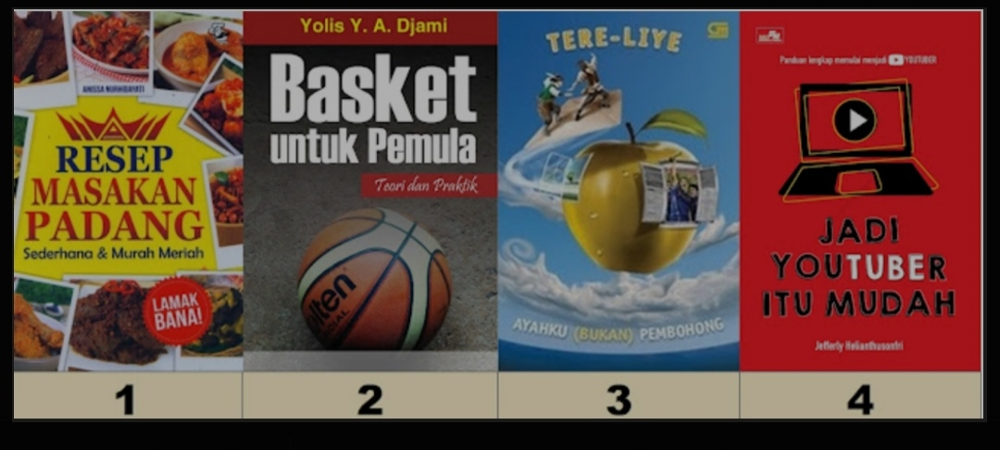
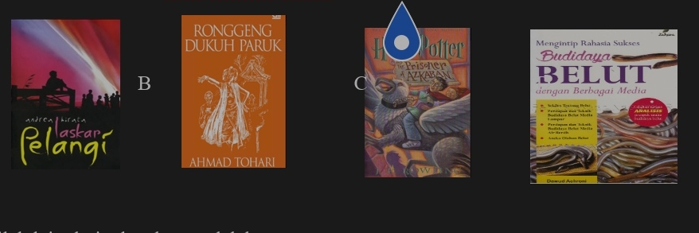
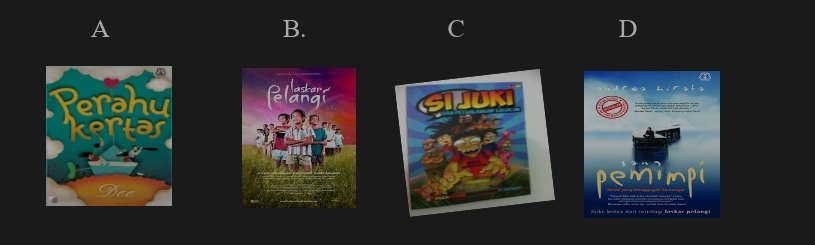

# ASAT-8-2024
# PAIBP

 
 
 
 
 
 
 
 
 
 
 
 
 
 
 
 
 
 
 
 
 
 
 
 
 
 
 
 
 
 
 
 
 
 
 
 
 
 
 
 
 
 
 
 
 
 
 
 
 
# BAHASA INDONESIA
1.	Buku yang berisi kisahan atau cerita yang dibuat berdasarkan khayalan atau imajinasi  pengarang .

Pernyataan tersebut merupakan pengertian dari . . . . A

A.	Buku Fiksi  

B.	Buku sejarah

C.	Buku non Fiksi

D.	Buku pengayaan

2.	Salah satu contoh dari buku nonfiksi adalah . . . . D

A.	Puisi

B.	Novel

C.	Cerpen

D.	Biografi 

3.	Berikut ini yakni bagian-bagian (unsur-unsur )buku nonfiksi,kecuali . . . . C

A.  Judul buku

B.  Tema cerita  

C.   Judul sub bab

D.   Bahasa yang digunakan

4.	Setiap buku ,baik fiksi maupun nonfiksi yang sudah dibaca dapat kalian analisis berdasarkan . . . .C

A. Nilai dan kehidupan

B. Intrinsik dan ekstrinsik

C. Kebahasaan dan unsur

D. Struktur dan kebahasaan  

5.	Di bawah ini merupakan komentar buku fiksi . . . .C

A. Buku ini ditulis dengan sistematika yang runtut sehingga sangat mudah dipahami

B. Secara keseluruhan buku ini hanya menginformasikan hal yang telah diketahui umum

C. Buku ini mengangkat masalah actual dan cerdas,tetapi tidak terkesan menggurui

D. Imajinasinya sangat kuat membangun plot cerita fantasi local yang tidak kalah keren dengan fantasi asing  

6.	Berikut ini bukan hal yang harus kita lakukan saat meringkas buku . . . .B

A. Membaca buku yang akan diringkas

B. Membeli buku sebanyak-banyaknya 

C. Mencatat judul buku yang akan kita ringkas

D. Mencatat garis besar isinya dan merangkainya menjadi sebuah ringkasan 

7.	Karya tulis yang memiliki fungsi sebagai ruang akademisi bagi masyarakat umum untuk mengulas sebuah karya terbaru merupakan pengertian dari . . . .  B

A. Teks Narasi

B. Teks Resensi 

C. Teks Observasi 

D. Teks Eksplorasi  

8.	Berikut ini yang bukan karya sastra adalah. . . .   B

A. Buku

B. Film   

C. Novel

D. Naskah drama

9.	Berikut ini adalah sebuah kalimat yang mengungkapkan sebuah kelemahan buku,adalah . . . . D

A.	Cerita buku ini cukup menarik karena memperlihatkan karakter yang kuat

B.	Hadirnya buku ini telah memperkaya pengetahuan mengenai Kesehatan mental

C.	Buku ini cukup menarik ,ada beberapa bagian yang jalan ceritanya tidak tertebak

D.	Buku ini sebenarnya menarik ,tetapi penulis sering menggunakan istilah yang tidak umum 

10.	 Perbedaan antara buku fiksi dan nonfiksi adalah . . . .C

A.	Buku fiksi isinya berdasarkan kenyataan ,sedangkan nonfiksi berdasarkan karangan tidak nyata.

B.	Buku fiksi dikarang oleh para ilmuwan dan peneliti, sedangkan buku nonfiksi dikarang oleh sembarang orang.

C.	Buku fiksi memuat hal yang bersifat imajinatif, sedangkan nonfiksi bersifat nyata atau berdasarkan - keilmuan. 

D.	Buku fiksi isinya menggambarkan suatu objek , sedangkan buku nonfiksi berisi pendapat-pendapat seseorang.

11.	 Judul            :  Kotak Sulap Paman Tom

       Pengarang    :  Maya Lestari Gf

       Tahun           :  2020

     Merupakan identitas dari sebuah karya . . . .D

A.	Film

B.	Lagu

C.	Drama

D.	Cerpen 

12.	 Alur yang dibuka dengan penceritaan kejadian masa lampau di awal cerita dan diselesaikan dengan konflik pada masa kini adalah . . . c

A.	Jalan cerita

B.	Alur maju

C.	Alur mundur   

D.	Alur Campuran

13. Berikut ini yang merupakan ciri dari buku fiksi adalah . . . .C

A. Menggunakan Bahasa formal

B. Berdasarkan informasi factual

C. Gaya Bahasa menggunakan majas 

D. Berisi ide baru atau penyempurnaan dari ide yang telah ada sebelumnya

14. Unsur yang dapat dikomentari dari buku nonfiksi adalah. . . . A

A. Isi buku  

B. Alur cerita

C. Tema cerita

D. Penokohan

15.Perhatikan kumpulan gambar sampul buku berikut !   

    

Buku yang termasuk fiksi ditunjukkan oleh nomor . . . .C

A.	1

B.	2

C.	3 

D.	4

16.Perhatikan penggalan cerpen di bawah ini!

Parki ingin membantah kalau makanan bergizi itu bukan Cuma telur, masih ada tahu, tempe,kacang ,dan ikan,tetapi ibu tidak ingin mendengarkan. Menurut ibu ,komposisi gizi dalam sebutir telur sangat sempurna. Telur memiliki kalsium yang dibutuhkan Parki agar tulang-tulangnya kuat .Ibu ingin Parki tumbuh setinggi pemain-pemain basket Profesional.Jadi ,ia memasak telur setiap hari.Kadang telur itu direbus , kadang dibuat jadi telur mata sapi atau dijadikan telur dadar.

Sifat tokoh ibu pada penggalan cerpen di atas adalah . . . . D

A.	Egois   

B.	Ramah

C.	Penyabar

D.	Penyayang

17.Perhatikan penggalan teks cerita fiksi berikut!      

Ia dengar ibunya membisikkan kalimat itu di telinganya . Samar-samar ia rasakan nafas ibunya yang lemah napasnya, semakin lemah sejak beberapa hari terakhir ini ibunya hanya bisa terbaring tanpa bisa melakukan apa-apa lagi.Alesia ,gadis berwajah pucat itu, hanya bisa duduk di sisi tempat tidur,tangan kanannya menggenggam tangan sang ibu,ada rasa dingin yang seolah menyatu sebagai pusaran takdir, sebagai rangkaian ,sebagai rangkaian kesunyian yang telah lama menggumpal di rumah itu.

Latar suasana yang tergambar dalam cerita adalah . . . . A

A. Kesedihan.  

B. Keresahan

C. Kegelisahan

D. Kebingungan.

18.Berikut yang termasuk buku nonfiksi adalah . . . .     D

 

A                             B       	                       C                                 D          												

                        

19..Istilah lain dari teks ulasan adalah . . . .A

A. Resensi 

B. Plagiasi

C. Komentar

D. Referensi

20. Berikut ini yang bukan pasangan padanan kata adalah . . . .  C

A. Lunglai  = Lemah

B. Menitik  = Menetes

C. Gerangan = Kiranya

D. Membuka = Menutup. 

21. Kalimat di bawah ini yang menggunakan makna konotasi adalah . . . . C

A. Rianti adalah gadis yang suka menolong.

B. Esti tangan kanannya sakit karena terkilir

C. Rani membawa buah tangan untuk teman-temannya.  

D. Rini selalu menjadi pembicaraan di kalangan anak muda.

22.Malin Kundang sudah bersiap berpamitan dengan ibunya.Ia membawa bekal dan uang secukupnya untuk merantau di kota.Saat Malin mohon pamit,ibunya terlihat sedih dan sebenarnya  tidak rela jika anaknya meninggalkannya sendiri di desa.

Ungkapan yang menggambarkan kondisi batin ibu Malin Kundang adalah . . . .  A

A.	Berat hati  

B.	Berat kepala

C.	Berat tangan

D.	Berat sebelah

23. Sulit sekali menemukan kekurangan novel ini.Semua unsur karya fiksi telah dipenuhi oleh pengarang  dengan cara yang cerdik. Novel ini cukup menghibur untuk dibaca oleh masyarakat umum.   

Masalah yang dinilai dari kutipan tersebut adalah . . . . A

A.Gaya bahasa yang dipakai

B.Latar belakang pengarang

C.Kekurangan atau kelemahan novel

D.Kelebihan dan kekurangan isi novel  

24.Berikut ini yang tidak termasuk  karya novel adalah ….  C

    
25. Dibandingkan dengan karya sastra sejenis lainnya ,Novel ini kurang berbobot.Lukisan perwatakan kurang begitu mendalam ,jalan ceritanya terkesan mendatar saja ,tidak ada hal-hal yang menarik perhatian pembaca. 
Penggalan teks ulasan di atas merupakan bagian . . . . C

A.	Latar teks

B.	Simpulan teks

C.	Kelemahan teks  

D.	Keunggulan teks

1.Ketika membaca sebuah puisi,kita harus memperhatikan irama.Hal ini bertujuan agar . . . .        C

a. Memukau penonton

b. Puisi lebih mudah dipahami

c. Tidak terlalu cepat atau lambat      

d. Membuat puisi jadi lebih menarik

2.Berikut ini adalah struktur fisik dari sebuah puisi,kecuali . . . .       D    

 a. Diksi 

 b. Imaji

 c. Rima

 d. Amanat    

3. Puisi cenderung menggunakan sebuah Bahasa yang bersifat . . . .  B        

a. Denotatif

b. Konotatif     

c. Leksikal

d. Gramatikal

4. Pemilihan kata dalam menulis sebuah puisi disebut dengan istilah . . . .     B

a. Imaji

b. Diksi     

c. Majas

d. Tipografi

5. Persamaan bunyi yang digunakan oleh penyair dalam penulisan puisi disebut dengan istilah . . . .        A

a. Rima     

b. Majas

c. Tiruan bunyi

d. Pengulangan kata

6. Membaca sebuah puisi secara berulang-ulang memiliki tujuan untuk . . . .     C

a. Melatih artikulasi vocal

b. Melatih pernapasan agar tidak pengap

c. Lebih memahami isi serta cara membaca puisi     

d. Menghapal puisi agar penampilan menjadi lebih bagus

7. Di bawah ini merupakan beberapa hal yang perlu diperhatikan Ketika membaca puisi , kecuali . . . .          C

a. Vokal ,ekspresi ,dan rima

b. Intonasi , ekspresi ,dan vocal    

c. Penghayatan,ekspresi,dan rima

d. Mimik ,penghayatan,dan intonasi

8. Agar membacakan puisi dengan baik kamu harus mampu untuk . . . . C

a. Menjiwai puisi yang kamu bacakan.

b. Membaca puisi dengan percaya diri yang tinggi

c. Mengetahui Teknik cara membacakan puisi dengan baik.

d. Memahami suasana, menghayati tema,dan makna puisi.  

9. Tujuan membaca sebuah puisi dalam hati secara berulang-ulang adalah . . . .   D

a. Menghapal puisi

b. Memahami puisi

c. Berlatih membaca dengan baik

d. Memahami isi dan cara membaca puisi   

10.Puisi memiliki ciri-ciri khusus yang membedakan dengan karya sastra lain.Berikut ciri-ciri puisi yang tepat adalah . . . .      C

a. Teks hanya mengandung makna denotasi

b. Bahasa lugas dan tidak banyak mengandung kiasan.

c. Bahasa padat dan mengutamakan keindahan kata-kata   

d. Berbentuk prosa dan menggunakan pola Bahasa yang renggang. 

Pahlawan Tak Dikenal

Sepuluh tahun yang lalu, dia terbaring

Tetapi bukan tidur, sayang

Sebuah lubang peluru bundar di dadanya

Senyum bekunya berkata, kita sedang perang 

Dia tidak tahu bilamana ia datang

Kedua tangannya memeluk senapan

Dia tidak tahu untuk siapa dia datang

Kemudian dia terbaring, tetapi bukan tidur, sayang 

............................

(Toto Sudarto Bahtiar)

11.Puisi di atas menuturkan tentang ...C

a. Seseorang yang sedang berjuang di medan perang                   

b. Pemimpin perang sedang memimpin pertempuran

c. Kematian seorang pejuang karena tertembak      

d.Seseorang yang terbaring sakit karena tertembak di medan pertempuran

12. Rima puisi Pahlawan Tak Dikenal bait pertama adalah ...        D

a. a-b-a-b

b. b-a-a-a     

c. a-b-b-a

d. a-a-b-a

13. Keindahan puisi di atas terlihat dari kepandaian penyair memilih kata. Salah satunya adalah kata terbaring. Makna kata tersebut adalah ...              D

a. Tidur

b. Pingsan

c. Sakit

d. Gugur      

14. Orang yang diungkapkan dalam puisi Pahlawan Tak Dikenal adalah seorang yang ikhlas membela bangsa, yang diisyaratkan dengan kalimat ...            B

a. Dia berbaring tetapi bukan tidur

b. Dia tidak tahu bilamana dia dating     

c. Dia memeluk senapan

d. Ada sebutir peluru di dadanya

15. Tubuh biru

Tatapan mata biru

Lelaki terguling di jalan

Lewat gardu Belanda dengan bumi

Berlindung warna malam

Sendiri masuk kota 

Ingin ikut ngubur ibunya

Tema puisi tersebut adalah ... D

a. Perlawanan

b. Keberanian

c. Kekejaman

d. Perjuangan      

16. Bila kasih mu ibarat samudra

Sempit lautan tuduh

Tempat ku mandi, mencuci lumut pada diri

Tempat ku berlayar, menebar pukat dan melempar sauh

Kalau aku ujian kemudian ditanya tentang pahlawan

Nama ku yang ku sebut paling dahulu

Lantaran ku tahu

Engkau ibu dan aku anak mu

Isi puisi tersebut menggambarkan ...	D

a. Kesedihan seorang anak

b. Kegelisahan hati seorang anak

c. Perasaan rindu seorang anak kepada ibunya

d. Perasaan sayang seorang anak kepada ibunya        

17. Perhatikan penggalan puisi berikut:

Dalam ribaan bahagia datang

Tersenyum bagai kencana

Mengharum bagai cendana ...

Dari penggalan puisi tersebut terdapat gaya bahasa: D

a. Hiperbola

b. Metafora

c. Litotes

d. Asosiasi       

18. Bacalah puisi berikut!

Perpisahan

Akhirnya peluit pun dibunyikan

Buat penghabisan kali kugenggam jarmu

Lewat celah kaca jendela

Lalu perlahan-lahan jarak antar kita

Mengembang jua

Dan tinggallah rel-rel, peron dan lampu

Yang menggigil di angin senja

Baris ke-6 dan ke-7 puisi tersebut menggunakan majas ...A

a. Personifikasi     

b. Metafora

c. Litotes

d. Asosiasi

19. Perhatikan penggalan puisi berikut!

Karangan Bunga

Tiga anak kecil

Dalam langkah malu-malu

Datang ke Salemba

Ini dari kami bertiga

Pita hitam dalam karangan bunga

Sebab kami ikut berduka

Bagi kakak yang tertembak mati tadi siang

Karya Taufik Ismail

Tema dalam puisi tersebut adalah ... B

a. Ketuhanan

b. Kemanusiaan     

c. Percintaan

d. Religius

20. Kalimat puisi berikut yang mengandung majas simile adalah . . . .C

a. Penguasa malam datang 

   Membawa mimpi ke setiap insan

b. Waktu seperti burung tanpa hinggapan     

    melewati hari-hari rubuh tanpa ratapan

c. Aku mencintaimu dengan segalanya

    Cintaku padamu sedalam samudra setinggi langit ketujuh

d. Aku kesepian dalam hiruk pikuk taman kota

    Aku dalam sedih di tengah canda tawa di sekitarku.

           

